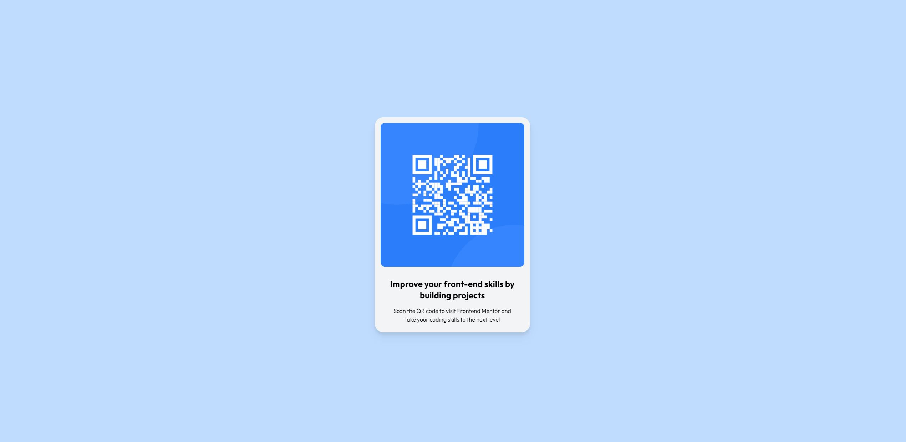

# Frontend Mentor - QR code component solution

This is a solution to the [QR code component challenge on Frontend Mentor](https://www.frontendmentor.io/challenges/qr-code-component-iux_sIO_H).

## Table of contents

-   [Overview](#overview)
    -   [Screenshot](#screenshot)
        [Links](#links)
-   [My process](#my-process)
    -   [Built with](#built-with)
    -   [What I learned](#what-i-learned)
    -   [Useful resources](#useful-resources)
-   [Author](#author)

## Overview

### Screenshot

### Links

-   [Live site](https://fem-qr-code-component-tailwind.netlify.app/)

## My process

### Built with

-   Semantic HTML5 markup
-   Flexbox
-   Mobile-first workflow
-   [Tailwind CSS](https://tailwindcss.com/) - For styles

### What I learned

Though I already know Tailwind, this was good practice for installing and using it.

### Useful resources

-   [Tailwind CSS](https://tailwindcss.com/)

## Author

-   Website - [Add your name here](https://www.danahong.com)
-   Frontend Mentor - [@Dana-Hong](https://www.frontendmentor.io/profile/Dana-Hong)
